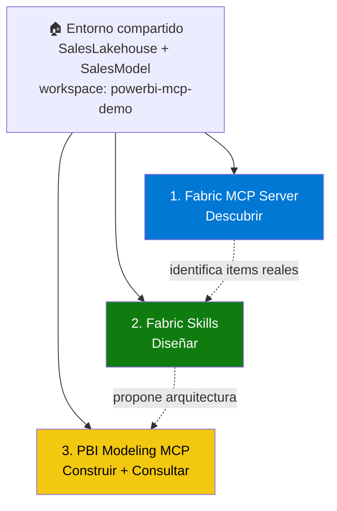

# Agentic Development en Fabric

Repositorio de exploración de tres herramientas de IA agéntica sobre Microsoft Fabric: [Fabric MCP Server](https://github.com/microsoft/mcp/tree/main/servers/Fabric.Mcp.Server), [Skills for Fabric](https://github.com/microsoft/skills-for-fabric), y [Power BI Modeling MCP Server](https://github.com/microsoft/powerbi-modeling-mcp). Las tres operan sobre el mismo entorno: un Lakehouse y un Semantic Model en un workspace de Microsoft Fabric.

> ⚠️ **Public Preview**: Las tres herramientas están en Public Preview. Las capacidades pueden cambiar antes de GA.

---

## Las 3 capas



| | 1. Fabric MCP Server | 2. Fabric Skills | 3. PBI Modeling MCP |
|--|:---:|:---:|:---:|
| Qué es | Extensión de VS Code (ejecuta) | Instrucciones `SKILL.md` (enseñan) | Servidor MCP local (ejecuta) |
| Responde | ¿Qué existe en la plataforma? | ¿Cómo debería estructurarse? | Construir y consultar el semantic model |
| Alcance | Catálogo de OneLake, esquemas de API, Data Factory | Todo el workspace (conceptual, vía agente) | Solo el Semantic Model |
| Dónde corre | VS Code + Copilot Chat | Terminal integrada, GitHub Copilot CLI | VS Code + Copilot Chat / Claude Code |

👉 Ver el flujo completo, encadenado paso a paso: [Caso conectado](docs/connected-scenario.md)

---

## Dos versiones por herramienta: local y remota

Tanto PBI Modeling MCP como Fabric MCP Server tienen una versión local y una remota. No son intercambiables, y en ambos casos la remota tiene problemas conocidos.

| | Local | Remoto |
|--|---|---|
| **PBI Modeling MCP** | Funcional (extensión VS Code) | Funcional (`powerbi-remote`, requiere tenant setting) |
| **Fabric MCP Server** | Funcional (extensión VS Code, ver advertencia en su [setup](01-fabric-mcp-server/setup.md)) | Falla en autenticación (`AADSTS9010010`, "Fabric Core MCP"). Sin fecha de arreglo confirmada. No se usa en este repositorio. |

---

## Estructura del repositorio

```
powerbi-mcp-demo/
├── README.md
├── CONTRIBUTING.md
├── docs/
│   └── connected-scenario.md          ← Cómo se encadenan las 3 secciones
├── environment/
│   ├── 01_fabric_setup.md             ← Crear Lakehouse y Semantic Model (compartido)
│   └── data/
│       ├── FactSales.csv
│       ├── DimProduct.csv
│       ├── DimCustomer.csv
│       └── DimDate.csv
├── 01-fabric-mcp-server/
│   ├── README.md
│   ├── setup.md
│   ├── scenarios/
│   │   └── 01_onelake_catalog_discovery.md
│   └── prompts/
├── 02-fabric-skills/
│   ├── README.md
│   ├── setup.md
│   ├── scenarios/
│   │   └── 01_document_workspace.md
│   └── prompts/
└── 03-pbi-modeling-mcp/
    ├── README.md
    ├── setup/
    │   ├── 01_claude_code.md
    │   └── 02_github_copilot.md
    ├── scenarios/
    │   └── 01...08 (ver README de la sección)
    └── prompts/
```

---

## Requisitos generales

- Cuenta de Microsoft Fabric con permisos de admin en el workspace
- [VS Code](https://code.visualstudio.com/download)
- [Node.js](https://nodejs.org) (LTS)

Cada sección documenta sus requisitos específicos adicionales en su propio `setup`.

---

## Comenzar

👉 **Paso 1:** [Crear el entorno compartido](environment/01_fabric_setup.md) (Lakehouse + Semantic Model)

👉 **Paso 2 - Elige una sección**, o sigue el [caso conectado](docs/connected-scenario.md) en orden:
- [1. Fabric MCP Server](01-fabric-mcp-server/) — Descubrir
- [2. Fabric Skills](02-fabric-skills/) — Diseñar
- [3. PBI Modeling MCP](03-pbi-modeling-mcp/) — Construir + Consultar
