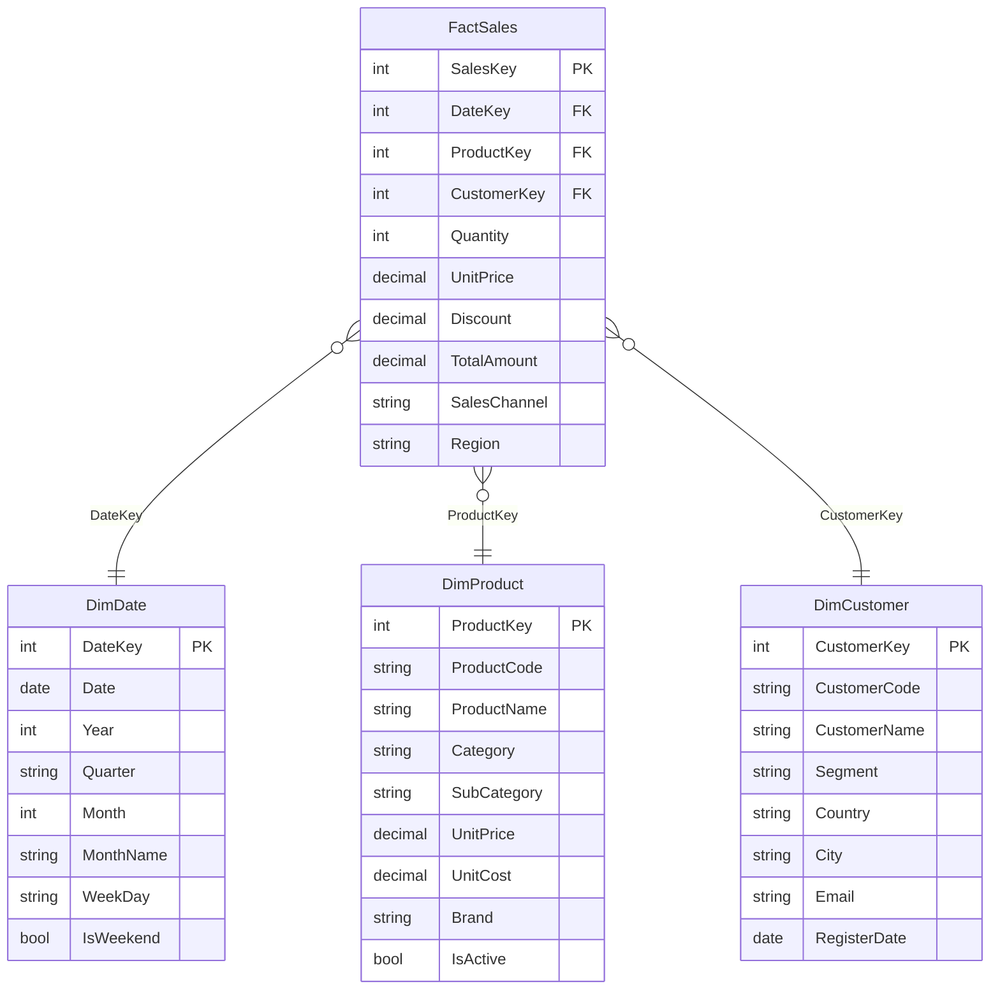

# Setup 01 - Microsoft Fabric: Lakehouse y Semantic Model

## Objetivo

Crear la base del demo: un Lakehouse con datos sintéticos de ventas retail y un Semantic Model vacío sobre el que el MCP operará.

> 💡 Este ejercicio usa Fabric (cloud). El MCP también soporta Power BI Desktop y archivos PBIP locales : ver [documentación oficial](https://github.com/microsoft/powerbi-modeling-mcp).

---

## Paso 1 - Crear el Workspace

1. Ve a [app.fabric.microsoft.com](https://app.fabric.microsoft.com)
2. Panel izquierdo → **Workspaces** → **New workspace**
3. Nombre: `powerbi-mcp-demo`
4. Clic en **Apply**

---

## Paso 2 - Crear el Lakehouse

1. Dentro del workspace → **+ New item** → **Lakehouse**
2. Nombre: `SalesLakehouse`
3. Clic en **Create**

---

## Paso 3 - Cargar los datos

Los CSVs están en la carpeta `data/` de este mismo directorio (`environment/data/`). Son datos sintéticos de ventas retail con el siguiente modelo:



**Para cargar:**
1. Dentro del `SalesLakehouse` → **Get data** → **Upload files**
2. Sube los 4 archivos CSV
3. Para cada archivo → **Load to table**
4. Verifica que las 4 tablas aparecen en el panel izquierdo

---

## Paso 4 - Crear el Semantic Model

> ⚠️ El modelo debe quedar **sin relaciones y sin medidas**, el MCP las creará durante el ejercicio.

1. Dentro del `SalesLakehouse` → **New semantic model** en la toolbar
2. Nombre: `SalesModel`
3. Selecciona las 4 tablas: `FactSales`, `DimProduct`, `DimCustomer`, `DimDate`
4. Clic en **Confirm**

---

## Resultado esperado

```
Workspace: powerbi-mcp-demo
├── SalesLakehouse
│   ├── FactSales
│   ├── DimProduct
│   ├── DimCustomer
│   └── DimDate
└── SalesModel (sin relaciones, sin medidas)
    ├── factsales
    ├── dimproduct
    ├── dimcustomer
    └── dimdate
```

---

## Siguiente paso

👉 Elige tu cliente AI:
- [Claude Code](../03-pbi-modeling-mcp/setup/01_claude_code.md) ← Recomendado
- [GitHub Copilot](../03-pbi-modeling-mcp/setup/02_github_copilot.md)
